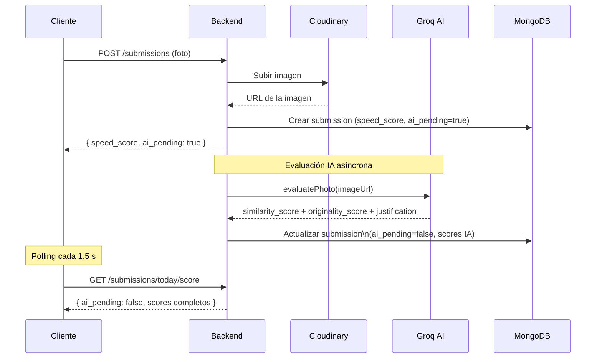

# 📸 SnapClash — Backend API

[](https://github.com/yriaforjan/snapclash-backend)
[](https://nodejs.org)
[](https://www.typescriptlang.org)
[](https://expressjs.com)
[](https://www.mongodb.com)
[](#-licencia)

## 📋 Descripción del Proyecto

**snapclash-backend** es la API REST que alimenta SnapClash, el reto fotográfico diario competitivo. Gestiona autenticación con verificación por email, retos fotográficos, subida de fotos a Cloudinary, evaluación automática con IA en background, sistema de grupos y feed social, ranking acumulado por grupo, y notificaciones push programadas.

---

## ✨ Características Principales

### 📷 Flujo de Envío con Evaluación en Background

El servidor responde inmediatamente tras subir la foto a Cloudinary con la puntuación de velocidad. Un modelo de visión evalúa la foto de forma asíncrona y el cliente hace polling hasta recibir el veredicto completo, evitando timeouts en entornos serverless.

### 🔐 Autenticación con Tokens de Acceso y Refresco

Sistema JWT de doble token: access token de corta duración en memoria y refresh token en cookie httpOnly. Incluye verificación de email obligatoria antes del primer acceso.

### 👥 Grupos Privados con Feed Condicional

El feed de fotos de un grupo se desbloquea únicamente cuando el usuario ha participado ese día, incentivando la participación antes de ver las fotos de los demás.

### 🔔 Notificaciones Push con VAPID

Suscripción a notificaciones web push para recordar el reto diario. Las notificaciones se programan con cron jobs y se envían mediante el protocolo Web Push con claves VAPID.

### 🛡️ Seguridad

- Cabeceras HTTP seguras con Helmet
- Limitación de peticiones con express-rate-limit
- Sanitización de inputs contra inyección NoSQL con express-mongo-sanitize
- CORS configurado con origen estricto

---

## 🛠️ Stack Tecnológico

| Categoría          | Tecnología                           | Versión | Propósito                                  |
| :----------------- | :----------------------------------- | :------ | :----------------------------------------- |
| **Runtime**        | Node.js                              | 18+     | Entorno de ejecución JavaScript            |
| **Lenguaje**       | TypeScript                           | 6.0     | Tipado estático                            |
| **Framework**      | Express                              | 5.2.1   | Framework web minimalista                  |
| **Base de datos**  | MongoDB + Mongoose                   | 9.6.3   | Persistencia de datos                      |
| **Autenticación**  | JSON Web Tokens                      | 9.0.3   | Tokens de acceso y refresco                |
| **Contraseñas**    | bcryptjs                             | 3.0.3   | Hash seguro de contraseñas                 |
| **Ficheros**       | Multer                               | 2.1.1   | Manejo de subida de archivos               |
| **Imágenes**       | Sharp                                | 0.35.2  | Compresión y redimensionado antes de subir |
| **Almacenamiento** | Cloudinary                           | 2.10.0  | Almacenamiento de imágenes en la nube      |
| **IA**             | Groq (Llama 4 Scout Vision)          | —       | Evaluación automática de fotos             |
| **Email**          | Brevo                                | 5.0.4   | Envío de emails de verificación            |
| **Push**           | web-push                             | 3.6.7   | Notificaciones push con VAPID              |
| **Cron**           | node-cron                            | 4.2.1   | Tareas programadas                         |
| **Seguridad**      | Helmet + rate-limit + mongo-sanitize | —       | Hardening de seguridad                     |

---

## ✅ Requisitos Previos

| Requisito        | Versión | Notas                                             |
| :--------------- | :------ | :------------------------------------------------ |
| **Node.js**      | 18+     | —                                                 |
| **MongoDB**      | 6+      | Local o MongoDB Atlas                             |
| **Cloudinary**   | —       | Cuenta necesaria para almacenamiento de imágenes  |
| **Groq**           | —   | API Key de Groq (console.groq.com)                |
| **Brevo**        | —       | Cuenta para envío de emails                       |
| **VAPID keys**   | —       | Generables con `npx web-push generate-vapid-keys` |

---

## ⚙️ Instalación y Configuración

### 1️⃣ Clonar el repositorio

```bash
git clone https://github.com/yriaforjan/snapclash-backend.git
cd snapclash-backend
```

### 2️⃣ Instalar dependencias

```bash
npm install
```

### 3️⃣ Configurar variables de entorno

Crea un archivo **`.env`** en la raíz del proyecto:

```env
PORT=8080
NODE_ENV=development

MONGODB_URI=tu-mongodb-uri
FRONTEND_URL=http://localhost:5173

JWT_ACCESS_SECRET=tu-secreto-de-acceso-seguro
JWT_REFRESH_SECRET=tu-secreto-de-refresco-seguro

CLOUDINARY_CLOUD_NAME=tu-cloud-name
CLOUDINARY_API_KEY=tu-api-key
CLOUDINARY_API_SECRET=tu-api-secret

GROQ_API_KEY=tu-api-key-de-groq

BREVO_API_KEY=tu-api-key-de-brevo
BREVO_SENDER_EMAIL=noreply@tusitio.com

VAPID_PUBLIC_KEY=tu-clave-publica-vapid
VAPID_PRIVATE_KEY=tu-clave-privada-vapid
VAPID_EMAIL=mailto:tu@email.com
```

| Variable                         |        Requerida        | Descripción                              |
| :------------------------------- | :---------------------: | :--------------------------------------- |
| `PORT`                           |    ❌ (def. `8080`)     | Puerto del servidor HTTP                 |
| `NODE_ENV`                       | ❌ (def. `development`) | Entorno de ejecución                     |
| `MONGODB_URI`                    |           ✅            | URL de conexión a MongoDB                |
| `FRONTEND_URL`                   |           ✅            | URL del frontend para configurar CORS    |
| `JWT_ACCESS_SECRET`              |           ✅            | Clave para firmar access tokens          |
| `JWT_REFRESH_SECRET`             |           ✅            | Clave para firmar refresh tokens         |
| `CLOUDINARY_CLOUD_NAME`          |           ✅            | Nombre de tu cloud en Cloudinary         |
| `CLOUDINARY_API_KEY`             |           ✅            | API Key de Cloudinary                    |
| `CLOUDINARY_API_SECRET`          |           ✅            | API Secret de Cloudinary                 |
| `GROQ_API_KEY`                   |           ✅            | API Key de Groq (console.groq.com)       |
| `BREVO_API_KEY`                  |           ✅            | API Key de Brevo                         |
| `BREVO_SENDER_EMAIL`             |           ✅            | Email verificado en Brevo como remitente |
| `VAPID_PUBLIC_KEY`               |           ✅            | Clave pública VAPID para web push        |
| `VAPID_PRIVATE_KEY`              |           ✅            | Clave privada VAPID para web push        |
| `VAPID_EMAIL`                    |           ✅            | Email de contacto VAPID (`mailto:...`)   |

### 4️⃣ Ejecutar en desarrollo

```bash
npm run dev
```

El servidor arrancará en `http://localhost:8080`. Puedes verificar que funciona accediendo a `GET /health`.

### 5️⃣ Sembrar datos (opcional)

```bash
npm run seed:challenges   # Retos de ejemplo
npm run seed:users        # Usuarios y grupos de prueba
```

### 6️⃣ Build de producción

```bash
npm run build   # Compila TypeScript → dist/
npm start       # Ejecuta node dist/index.js
```

---

## 🏗️ Arquitectura

### Flujo de Envío de Foto con Evaluación en Background



### Estructura del Proyecto

```text
snapclash-backend/
├── src/
│   ├── index.ts                    # Punto de entrada: conecta DB e inicia servidor
│   ├── app.ts                      # Express app: middlewares, rutas, seguridad
│   ├── config/
│   │   ├── cloudinary.ts           # Configuración y utilidades de Cloudinary
│   │   ├── constants.ts            # Constantes de puntuación y ventanas de tiempo
│   │   └── db.ts                   # Conexión a MongoDB
│   ├── controllers/
│   │   ├── auth.ts                 # Register, login, logout, refresh, verificación email
│   │   ├── challenge.ts            # Creación, consulta y revelación de retos
│   │   ├── comment.ts              # Comentarios y respuestas en el feed
│   │   ├── group.ts                # Crear, unirse y consultar grupos
│   │   ├── push.ts                 # Suscripción a notificaciones push
│   │   ├── ranking.ts              # Ranking de grupo por puntuación total
│   │   ├── submission.ts           # Subida de fotos, feed, historial y scores
│   │   └── user.ts                 # Perfil, avatar y contraseña
│   ├── jobs/
│   │   └── notifications.ts        # Cron jobs para notificaciones push diarias
│   ├── middlewares/
│   │   ├── auth.ts                 # Autenticación JWT y autorización admin
│   │   └── upload.ts               # Multer: validación y procesado de imágenes
│   ├── models/
│   │   ├── Challenge.ts            # Esquema de reto diario
│   │   ├── Comment.ts              # Esquema de comentario con soporte de respuestas
│   │   ├── Group.ts                # Esquema de grupo con lista de miembros
│   │   ├── PushSubscription.ts     # Esquema de suscripción push
│   │   ├── Submission.ts           # Esquema de envío con scores de velocidad e IA
│   │   └── User.ts                 # Esquema de usuario con email verificado
│   ├── routes/
│   │   ├── auth.ts                 # /api/v1/auth
│   │   ├── challenge.ts            # /api/v1/challenges
│   │   ├── comment.ts              # /api/v1/comments
│   │   ├── group.ts                # /api/v1/groups
│   │   ├── push.ts                 # /api/v1/push
│   │   ├── ranking.ts              # /api/v1/ranking
│   │   ├── submission.ts           # /api/v1/submissions
│   │   └── user.ts                 # /api/v1/users
│   ├── seeds/
│   │   ├── seedChallenges.ts       # Seed de retos de ejemplo
│   │   └── seedUsersAndGroups.ts   # Seed de usuarios y grupos de prueba
│   ├── services/
│   │   └── ai.ts                   # Evaluación de fotos con Groq (Llama Vision)
│   ├── types/
│   │   └── express.d.ts            # Extensión de tipos de Express (req.user)
│   └── utils/
│       ├── challenge.ts            # Helper para obtener el reto activo del día
│       └── date.ts                 # Utilidades de fecha (reto activo)
├── .env                            # Variables de entorno (no versionado)
├── package.json
└── tsconfig.json
```

---

## 📡 Endpoints de la API

Todos los endpoints están bajo el prefijo `/api/v1`. Los endpoints marcados con ✅ requieren token JWT en la cabecera `Authorization: Bearer <token>`.

### 🔐 Auth — `/api/v1/auth`

| Método | Ruta                   | Auth | Descripción                            |
| ------ | ---------------------- | :--: | -------------------------------------- |
| POST   | `/register`            |  —   | Registro con email y contraseña        |
| POST   | `/login`               |  —   | Login, devuelve access y refresh token |
| POST   | `/logout`              |  —   | Invalida el refresh token              |
| POST   | `/refresh`             |  —   | Renueva el access token                |
| GET    | `/verify-email`        |  —   | Verificación de email por token        |
| POST   | `/resend-verification` |  —   | Reenvío del email de verificación      |

### 👤 Usuarios — `/api/v1/users`

| Método | Ruta           | Auth | Descripción                    |
| ------ | -------------- | :--: | ------------------------------ |
| GET    | `/me`          |  ✅  | Obtener perfil propio          |
| PUT    | `/me`          |  ✅  | Actualizar nombre de usuario   |
| POST   | `/me/avatar`   |  ✅  | Subir nuevo avatar             |
| PUT    | `/me/password` |  ✅  | Cambiar contraseña             |
| GET    | `/:id`         |  ✅  | Obtener perfil de otro usuario |

### 🎯 Retos — `/api/v1/challenges`

| Método | Ruta            |   Auth   | Descripción                              |
| ------ | --------------- | :------: | ---------------------------------------- |
| POST   | `/`             | ✅ Admin | Crear nuevo reto                         |
| GET    | `/today`        |    ✅    | Consultar reto del día                   |
| POST   | `/today/reveal` |    ✅    | Revelar el reto (inicia el temporizador) |

### 📷 Envíos — `/api/v1/submissions`

| Método | Ruta             | Auth | Descripción                            |
| ------ | ---------------- | :--: | -------------------------------------- |
| POST   | `/`              |  ✅  | Subir foto del reto                    |
| GET    | `/today/score`   |  ✅  | Consultar scores actuales (polling IA) |
| POST   | `/today/retry`   |  ✅  | Reintentar evaluación IA si falló      |
| GET    | `/feed/:groupId` |  ✅  | Feed de fotos del grupo                |
| GET    | `/history`       |  ✅  | Historial de envíos propios            |

### 👥 Grupos — `/api/v1/groups`

| Método | Ruta           | Auth | Descripción                  |
| ------ | -------------- | :--: | ---------------------------- |
| POST   | `/`            |  ✅  | Crear nuevo grupo            |
| POST   | `/join`        |  ✅  | Unirse a un grupo por código |
| GET    | `/`            |  ✅  | Listar grupos del usuario    |
| GET    | `/:id/members` |  ✅  | Miembros de un grupo         |

### 🏆 Ranking — `/api/v1/ranking`

| Método | Ruta        | Auth | Descripción                 |
| ------ | ----------- | :--: | --------------------------- |
| GET    | `/:groupId` |  ✅  | Ranking acumulado del grupo |

### 💬 Comentarios — `/api/v1/comments`

| Método | Ruta                      | Auth | Descripción                     |
| ------ | ------------------------- | :--: | ------------------------------- |
| GET    | `/:groupId/:submissionId` |  ✅  | Obtener comentarios de una foto |
| POST   | `/:groupId/:submissionId` |  ✅  | Añadir comentario o respuesta   |

### 🔔 Push — `/api/v1/push`

| Método | Ruta           | Auth | Descripción                       |
| ------ | -------------- | :--: | --------------------------------- |
| POST   | `/subscribe`   |  ✅  | Suscribirse a notificaciones push |
| DELETE | `/unsubscribe` |  ✅  | Cancelar suscripción              |

---

## 🏅 Sistema de Puntuación

Cada envío se puntúa en tres categorías (máximo 100 pts cada una):

| Categoría        | Cómo se calcula                                  | Cuándo                      |
| :--------------- | :----------------------------------------------- | :-------------------------- |
| **Velocidad**    | Tiempo transcurrido desde la revelación del reto | En el momento del envío     |
| **Similitud**    | Parecido de la foto con el reto (IA)             | En background tras el envío |
| **Originalidad** | Creatividad y composición (IA)                   | En background tras el envío |

**Total** = `(velocidad + similitud + originalidad) × multiplicador`

Los retos de fin de semana especiales aplican un multiplicador de **×1.5**.

> `ai_status` puede ser `pending`, `completed` o `failed`. El endpoint `/today/score` expone `ai_pending` y `ai_failed` para que el cliente sepa el estado exacto. Si la evaluación falla, el cliente muestra un botón de reintento que llama a `POST /today/retry`, el cual descarga la foto de Cloudinary y relanza la evaluación en background.

---

## 📄 Licencia

© 2026 Yria Forján Oliveira. Todos los derechos reservados.  
Desarrollado como Trabajo de Fin de Máster (TFM).

---

## 👩🏼‍💻 Autor

Desarrollado por **Yria Forján Oliveira**

GitHub: [@yriaforjan](https://github.com/yriaforjan)
